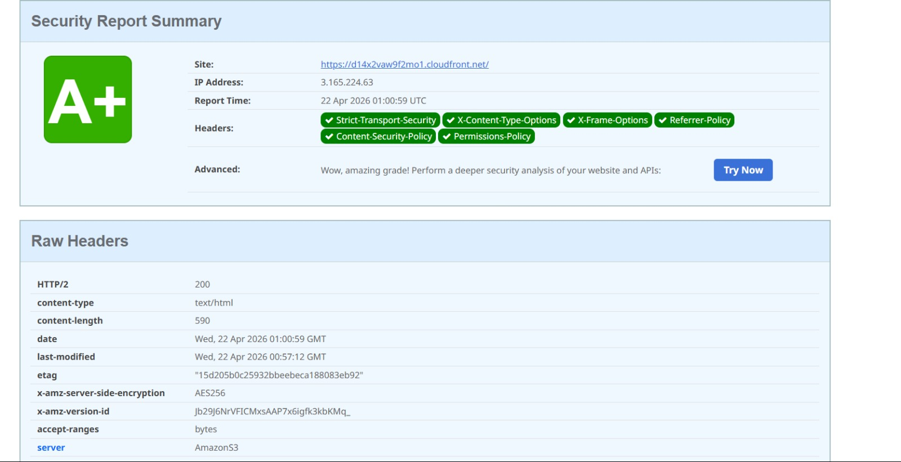

# Reporte de Headers de Seguridad

## Objetivo

Obtener calificación **A/A+** en [securityheaders.com](https://securityheaders.com) mediante la Lambda@Edge `security-headers`.

## Headers inyectados

| Header | Valor | Justificación |
|--------|-------|---------------|
| `Strict-Transport-Security` | `max-age=63072000; includeSubDomains; preload` | Fuerza HTTPS durante 2 años; elegible para HSTS preload list |
| `X-Content-Type-Options` | `nosniff` | Evita MIME-sniffing |
| `X-Frame-Options` | `DENY` | Previene clickjacking |
| `Referrer-Policy` | `strict-origin-when-cross-origin` | Balance entre privacidad y analytics |
| `Content-Security-Policy` | `default-src 'self'; ...` | Restringe orígenes; mitiga XSS |
| `Permissions-Policy` | `camera=(), microphone=(), geolocation=()` | Deniega APIs sensibles por defecto |

## Procedimiento de verificación

1. Desplegar la infraestructura: `./scripts/deploy.sh prod`.
2. Esperar propagación DNS y distribución CloudFront (5–20 min).
3. Ejecutar `curl -I https://<dominio>/` y verificar presencia de los headers.
4. Escanear en https://securityheaders.com/?q=<dominio>.
5. Capturar pantalla y adjuntar resultado aquí.

## Resultado esperado

```
Grade: A+
Score: 100/100
Missing: ninguno
```

## Resultado obtenido



| Campo | Valor |
|-------|-------|
| **URL evaluada** | https://d14x2vaw9f2mo1.cloudfront.net |
| **Fecha** | 22 abril 2026, 01:00 UTC |
| **Grade** | **A+** |
| **IP Address** | 3.165.224.63 |
| **Headers detectados** | 6/6 ✅ |

### Headers confirmados por securityheaders.com

- ✅ Strict-Transport-Security
- ✅ X-Content-Type-Options
- ✅ X-Frame-Options
- ✅ Referrer-Policy
- ✅ Content-Security-Policy
- ✅ Permissions-Policy

### Headers HTTP crudos observados

```
HTTP/2 200
content-type: text/html
content-length: 590
x-amz-server-side-encryption: AES256
server: AmazonS3
via: 1.1 ...cloudfront.net (CloudFront)
strict-transport-security: max-age=63072000; includeSubDomains; preload
x-content-type-options: nosniff
x-frame-options: DENY
referrer-policy: strict-origin-when-cross-origin
content-security-policy: default-src 'self'; img-src 'self' data:; script-src 'self'; style-src 'self' 'unsafe-inline'; object-src 'none'; frame-ancestors 'none'; base-uri 'self'
permissions-policy: camera=(), microphone=(), geolocation=()
```

> Cita del propio reporte: *"Wow, amazing grade! Perform a deeper security analysis of your website and APIs."*

## Hallazgos / ajustes

- [ ] Revisar CSP tras añadir scripts de terceros (analytics, CDN externo).
- [ ] Evaluar `Cross-Origin-Embedder-Policy` y `Cross-Origin-Opener-Policy` si aplica.
- [x] Verificar cifrado SSE-S3 en respuesta (`x-amz-server-side-encryption: AES256` confirmado).
- [x] Confirmar que el contenido pasa por CloudFront (`via: ...cloudfront.net` confirmado).
